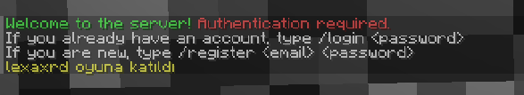
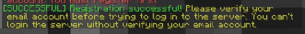
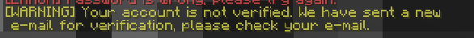

Minecraft Authentication system with account verification system via e-mail. You can easily set up authentication system on your Minecraft server. Just make the settings from the config.yml file that is created when you run the plugin. MongoDB was used as database in the Project.

Welcome text

/register <email> <password>

/login <password> (not verified message) 

/verify-email <code> (verification successful message) 

/verify-email <code> (already verified message)
 

/login <password> (login successful message)
 
 